# sanity checks for reinforcement-learning explanations

**a null-model test for whether a feature attribution carries any information,
and evidence that the established construction does not transfer to RL.**

Aaryan Singh · code and data: this repository · `./reproduce.sh`

---

## abstract

Feature attributions are proposed as a mechanism for oversight of learned
agents. We show a case where every conventional check on an attribution passes
and the attribution is nevertheless empty. On a provably efficient market, a PPO
agent with no measurable edge (-0.418 per episode, p = 0.13 against doing
nothing) produces explanations that are stable across seeds (rank correlation
0.865, unanimous on the most important feature), have a top-k ranking certified
separable beyond its own estimation error, and read as a plausible story. A
null-model test built on the Shapley efficiency axiom shows they are
indistinguishable from explanations of agents trained where there is nothing to
learn (z = -0.15, p = 0.92), while correctly flagging a planted signal
(z = +12.27). We further show the explanation can be rewritten at no performance
cost, and that this is possible **exactly** where the feature is not
load-bearing: suppressing a genuinely necessary feature costs 81% of return,
suppressing the market agent's dominant feature costs nothing measurable.
Finally, on CartPole and Acrobot we find that the established weight-
randomization null of Adebayo et al. produces a reference distribution 42x wider
than an environment-level null, and consequently has almost no power: across
eight checkpoints it never exceeds z = 2.45, including on a converged agent.

## 1. what is and is not claimed

The argument that Shapley explanations in RL should be built on outcomes rather
than on the policy's output is **not ours**. It is the thesis of SVERL (Beechey,
Smith and Şimşek, ICML 2023), and FastSVERL (Beechey and Şimşek, NeurIPS 2025)
extends it to the scalability, off-policy and temporal problems this work only
names. Our attribution machinery is an independent from-scratch implementation
of that argument.

The null-model test is an adaptation of the **data randomization test** of
Adebayo et al. (2018), which is standard in supervised XAI. Prior work applying
sanity checks to deep RL applied only the *parameter* randomization test, noting
that the data randomization test has no obvious RL analogue because there is no
dataset to permute.

What we contribute: an RL analogue of that test that needs no access to task
internals, a demonstration that the established alternative fails in RL and why,
a power characterisation, and the steering result.

## 3. explanations, and whether they are correct

Shapley values were implemented from scratch (permutation sampling and
KernelSHAP) and validated three ways: against the closed form for a linear model,
where `phi_i = w_i(x_i - E[x_i])` exactly; against the efficiency, symmetry,
dummy and additivity axioms; and against `shap`'s KernelExplainer as an
independent implementation. the library is a dependency of the test suite only.

### 3.1 can the attribution find a signal we planted?

on a synthetic corpus where exactly one of 18 features is informative about
settlement, attribution of the episode return ranks that feature **first with 55%
of the total attribution mass**. this check is not available on real data, which
is why it is run here first.

the precise claim matters. the planted feature is the only one informative about
the *outcome*. others can still legitimately affect the *return* without
predicting anything: `time_to_expiry_frac` draws +25.96 because an agent that
cannot tell where it is in the episode trades incoherently and pays fees. the
test is that the planted feature ranks first with the majority of the mass, not
that everything else is zero.

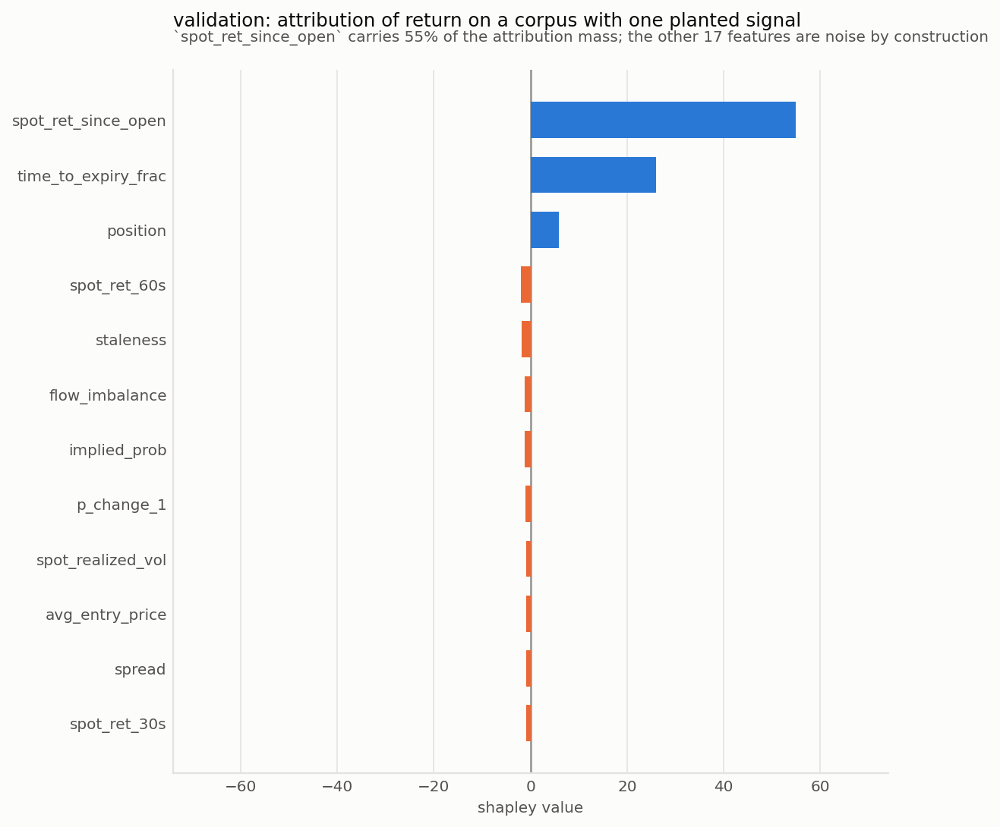

### 3.2 per-decision attribution is misleading, measurably

**the decoy.** a corpus with a feature correlating 0.989 with settlement
in-sample and 0.006 out-of-sample. the agent learns it (+47.24 in-sample, -6.83
held out). explained on held-out episodes where the feature is provably worthless:

| method | share of mass | rank |
|---|---|---|
| per-decision, `pi(a|s)` | 6.5% | **3 of 18** |
| trajectory-aware, return | 1.1% | **10 of 18** |

both are true statements and only one is useful. the policy really does key on
the decoy, so per-decision attribution is correct about *behaviour* and
misleading about *value*. an auditor asking what an agent relies on that does not
work gets the wrong answer from it.

**deletion curves**, the standard faithfulness test. removing features in the
order each ranking calls important:

| ranking | AUC (lower is more faithful) |
|---|---|
| trajectory-aware | **-187.8** |
| per-decision | -165.3 |
| random control | +366.6 |

the gap concentrates at k=1: removing the single most important feature costs
-15.87 under the trajectory ranking against +8.06 under per-decision. they
disagree about which feature matters most, and the trajectory answer is the one
that bites. the flat random control is what makes this a comparison rather than
an artifact of masking.

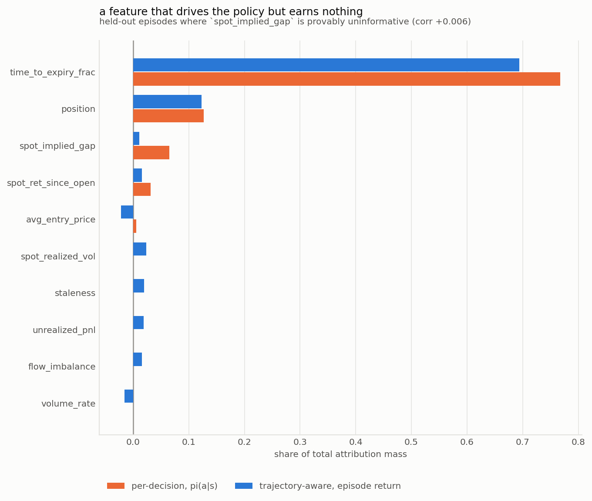
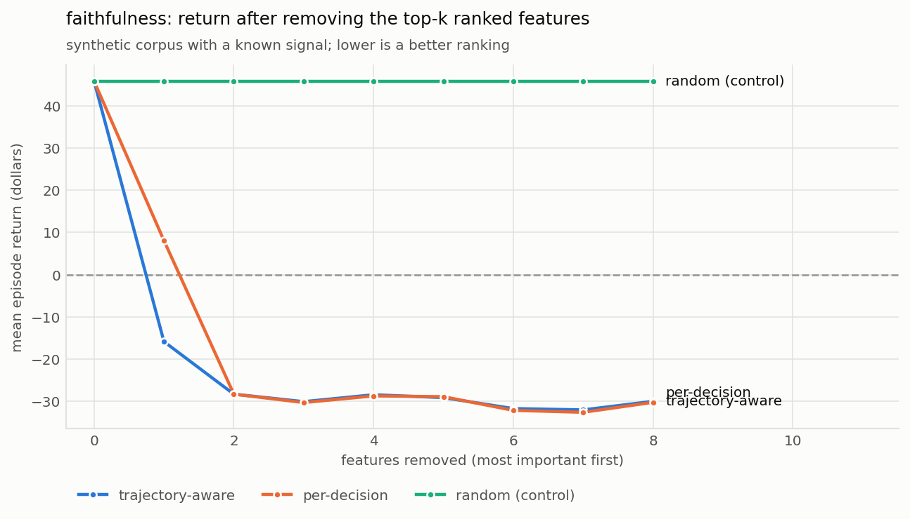

### 3.3 three targets on the real agent

`time_to_expiry_frac` dominates behaviour, value and outcomes alike, consistent
with an agent that learned *when not to trade* rather than *what to predict*. the
whole observation appears to be worth **+7.4 per episode** against being blind.

section 3.5 shows that this number is not distinguishable from noise. an earlier
draft of this report presented it as a finding. it is retained above, with the
correction below, because the sequence is the point.

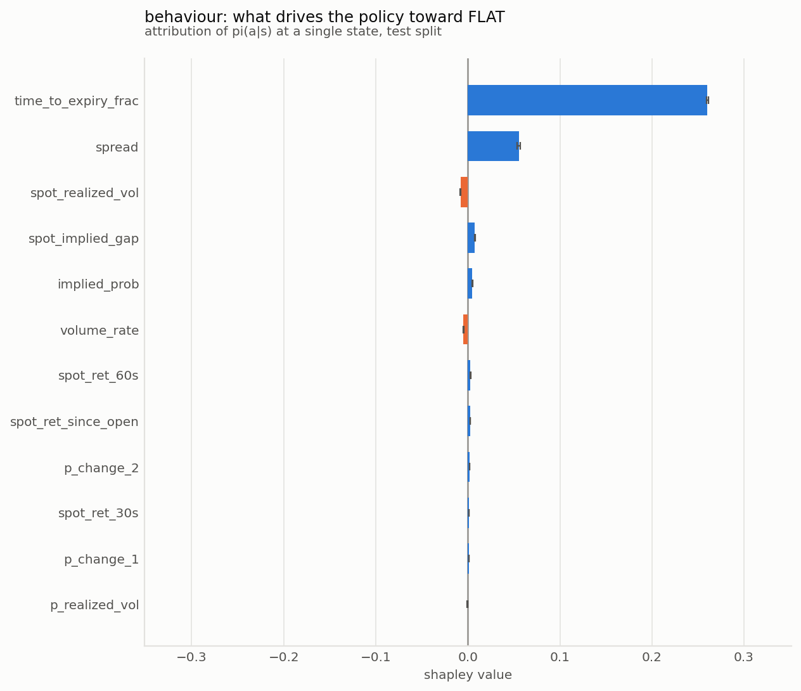
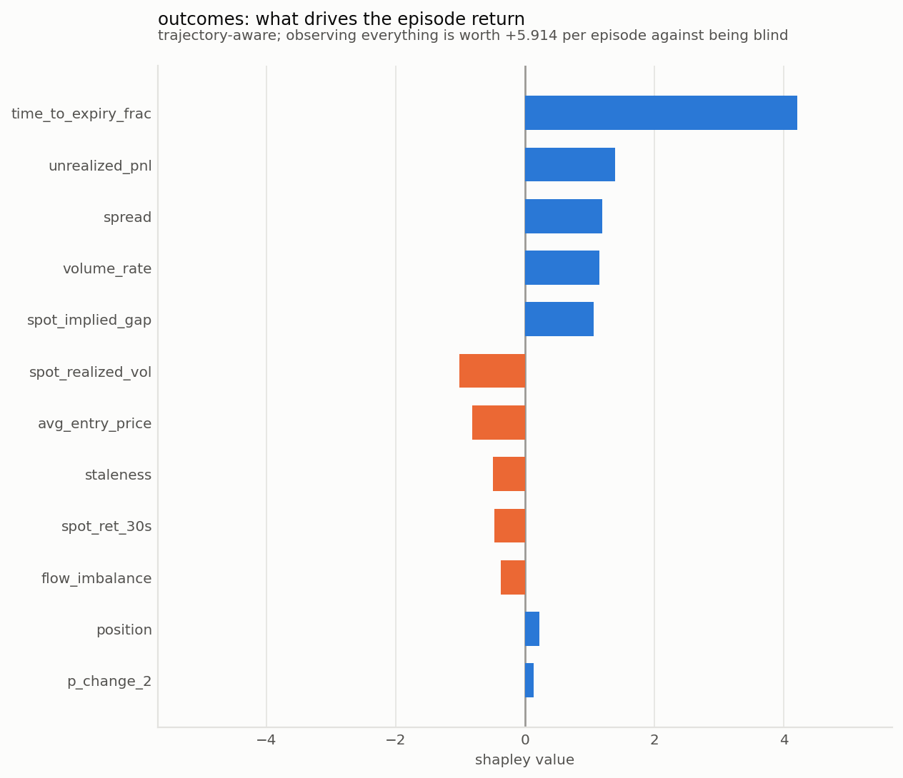

### 3.4 the explanations are consistent across seeds

five independently trained agents, **9 of 10 pairs statistically
indistinguishable in test performance** by paired bootstrap:

| target | rank corr (mean / min) | top-1 agreement | sign agreement |
|---|---|---|---|
| behaviour, `pi(a|s)` | +0.865 / +0.794 | 100% | 100% |
| outcomes, episode return | +0.680 / +0.498 | 100% | 99% |

two hypotheses were tested here and both were rejected. explanations are *not*
seed-unstable, and outcome-based attribution is *less* stable than
behaviour-based rather than more. the likely cause of the second is estimator
variance rather than conceptual instability: attributing behaviour is a
deterministic forward pass, while attributing outcomes requires estimating
expected returns from rollouts with a per-episode standard deviation near 50.
that is an independent motivation for FastSVERL's scalability work rather than a
new argument for the framing.

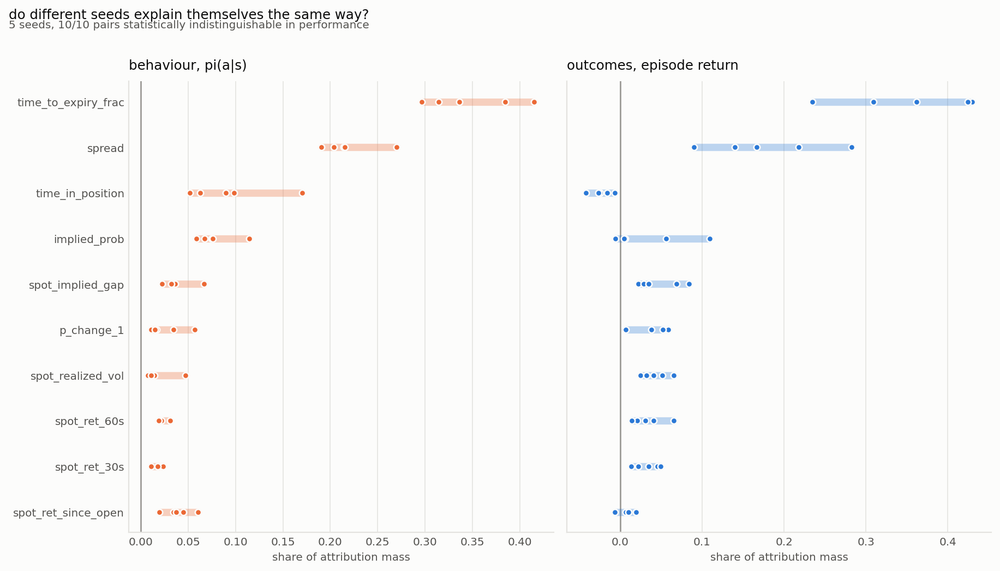

### 3.5 consistency is not evidence of validity

the agent explained in 3.3 and 3.4 earns -0.418 per episode and is
statistically indistinguishable from doing nothing (p = 0.13). its explanations
are nevertheless stable, structured, and readable. so a natural question: would
an agent with *nothing whatsoever to learn* produce a visibly different
explanation?

the Shapley framework supplies its own test statistic. by efficiency,
`sum_i phi_i = v(N) - v(empty)`, so the **span** is the total value of observing
the state at all. the null distribution comes from 24 agents trained normally on
structure-free versions of the same environment. this is the RL analogue of the
randomization tests of Adebayo et al. (2018), with the difference that the null
here is one that occurs in deployment rather than an artificial weight or label
scramble.

| case | span | z | p | verdict |
|---|---|---|---|---|
| planted signal | +70.89 | **+12.27** | 0.040 | informative |
| null corpus | +11.86 | +0.72 | 0.480 | not distinguishable |
| **real market** | **+7.43** | **-0.15** | 0.920 | **not distinguishable** |

the test has power (it rejects on the planted signal) and specificity (it does
not reject on the null). the real agent's explanation sits at **z = -0.15**,
essentially at the centre of the distribution of explanations of nothing. agents
with nothing to learn produce a span of **+8.19 ± 5.11**; the real agent produces
+7.43.

so the `+5.914` reported in an earlier draft, and the `+7.4` in 3.3, are not
evidence of anything. the explanation is stable across seeds, unanimous on its
most important feature, semantically plausible, and empty.

**the methodological point.** consistency across runs is widely used as a proxy
for trustworthiness. here consistency is high (+0.865) exactly where the span
test says there is nothing to explain. the two properties are independent, and
only one of them was checkable before this test.

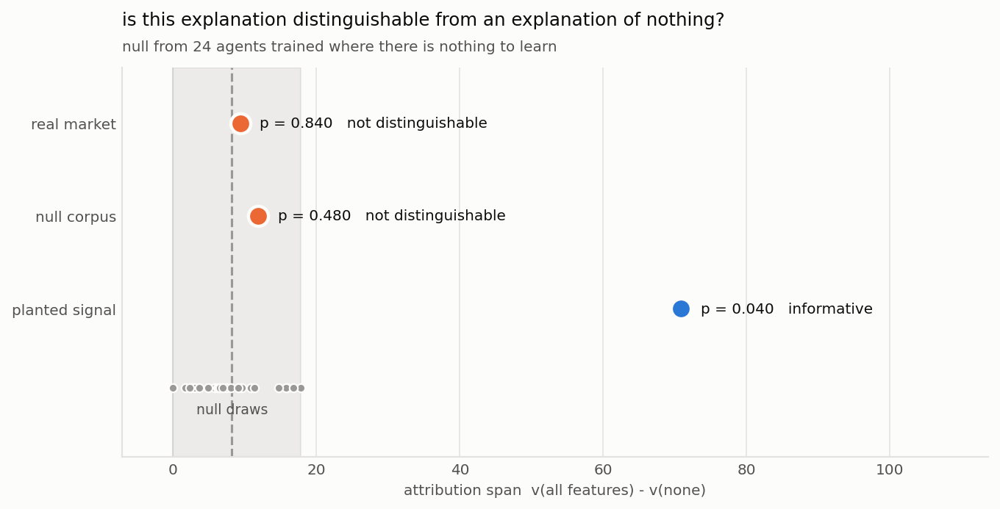

### 3.6 how much edge is needed before an explanation is trustworthy?

the test above is binary. sweeping the strength of a planted signal calibrates
it. the x axis is the agent's **measured edge**, not the latent signal strength,
because measured edge is what a practitioner has.

| planted strength | agent edge / ep | span | z | detected |
|---|---|---|---|---|
| 0.00 | +2.25 | +16.50 | +1.63 | no |
| 0.05 | +2.34 | +15.47 | +1.42 | no |
| **0.10** | **+3.45** | +21.60 | **+2.62** | **yes** |
| 0.20 | +15.41 | +39.13 | +6.06 | yes |
| 0.50 | +44.41 | +66.42 | +11.40 | yes |
| 1.00 | +47.11 | +70.89 | +12.27 | yes |

detection begins around **+3.45 per episode of measured edge**. the real agent
earns **-0.418**, an order of magnitude below the threshold and on the wrong
side of zero.

one caveat on the number: the sweep evaluates each agent on the corpus it
trained on, so the edges are in-sample and therefore optimistic. the threshold
should be read as a lower bound on what is required, and the monotonic
relationship rather than the exact value is the transferable part.

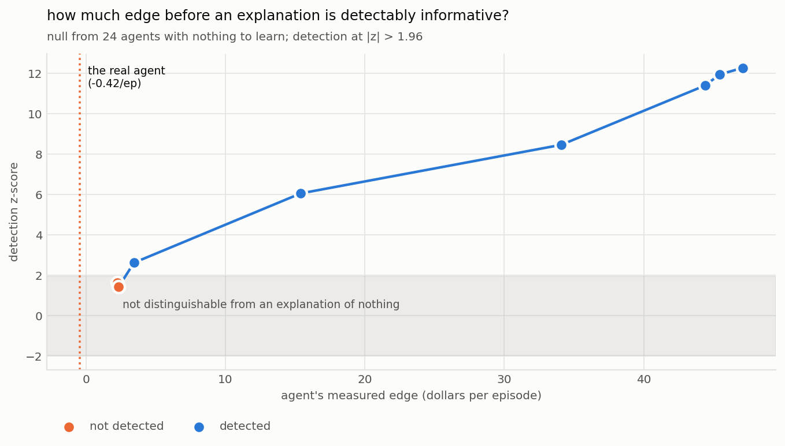

### 3.7 a precisely estimated description of nothing

the RankSHAP line of work certifies that a top-k Shapley ranking is stable given
Monte Carlo noise. that is a guarantee about the **estimator**. here is the
real agent's top-5, with its estimation error:

| rank | feature | value | std error |
|---|---|---|---|
| 1 | `time_to_expiry_frac` | 0.2625 | ±0.0009 |
| 2 | `spread` | 0.0543 | ±0.0010 |
| 3 | `spot_realized_vol` | 0.0080 | ±0.0002 |
| 4 | `spot_implied_gap` | 0.0070 | ±0.0003 |
| 5 | `implied_prob` | 0.0048 | ±0.0003 |

**all four adjacent pairs are separated beyond their combined standard error, so
the ranking is fully certified.** the same explanation fails the null test at
z = -0.15, p = 0.92.

so a top-k ranking can be certified stable while the explanation it ranks is
indistinguishable from an explanation of nothing. the two guarantees are
orthogonal, and only the first is commonly reported.

### 3.8 the explanation can be rewritten at no cost

if an explanation tracks something real, changing it should cost performance. an
auxiliary penalty during training, on the divergence between `pi(.|s)` and
`pi(.|s')` with the target feature resampled from the batch marginal, attacks
the attribution directly. the same perturbation Shapley measures.

run on two corpora. the control is the point.

| corpus | target feature | attribution | return | p vs baseline |
|---|---|---|---|---|
| real market | `time_to_expiry_frac` | 42.1% → **2.0%** | -0.78 → -1.51 | **0.280** |
| learnable synthetic | `spot_ret_since_open` | 46.5% → **1.5%** | +45.04 → **+8.66** | **<0.001** |

the attribution is equally suppressible in both cases, by 95% and 97%. the
difference is what it costs. on the synthetic corpus, where the feature *is* the
planted signal, suppressing it destroys **81% of the return**. on the real
market it costs nothing measurable.

**explanations are steerable at no performance cost exactly where they are not
tracking anything real.** that is an independent confirmation of section 3.5: the
null test says the real agent's explanation is uninformative, and the steering
experiment shows it can be rewritten for free. two different methods, same
conclusion.

**why this matters beyond this agent.** if an explanation can be rewritten
without changing behaviour, then an overseer inspecting attributions is not
learning about the agent, they are learning about the developer's training
choices. a developer who wanted their agent to appear not to use a particular
feature could arrange it, and every conventional check in section 3.7 would still
pass. that is a concrete false-assurance mechanism for interpretability-based
oversight, and it is measurable rather than hypothetical.

the control also rules out the deflationary reading. if steering had succeeded on
*both* corpora, the penalty would merely be defeating the attribution method
rather than changing what the agent relies on. it does not: where the feature is
load-bearing, the agent pays.

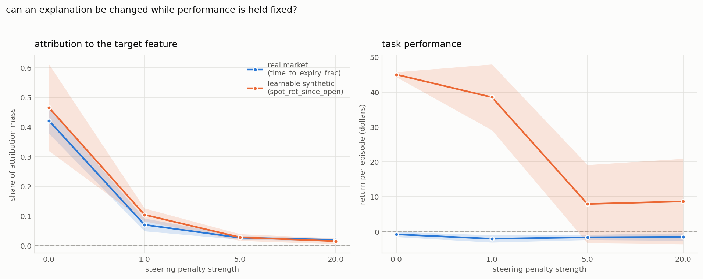

### 3.9 does any of this hold outside one market?

everything above is measured on Kalshi binaries. the same test was run on two
standard control tasks with no relationship to trading: CartPole-v1 and
Acrobot-v1. both have observation spaces small enough to enumerate every
coalition, so the per-feature Shapley values are exact. the test statistic is
the span `v(all) - v(none)`, which by efficiency needs only the two endpoint
evaluations.

**the established null construction does not transfer to RL.**

| environment | weight-randomization null | environment-randomization null | ratio |
|---|---|---|---|
| CartPole-v1 | +55.34 ± **138.92** | -1.35 ± **3.29** | 42x |
| Acrobot-v1 | +64.03 ± **124.94** | +0.00 ± **0.00** | degenerate |

randomizing network weights, the standard construction, produces a reference
distribution 42x wider on CartPole and unboundedly wider on Acrobot. a randomly
initialised policy behaves arbitrarily, so masking its inputs moves returns
unpredictably. a test built on that reference has almost no power:

| environment | training | return | span | z (env null) | z (weight null) |
|---|---|---|---|---|---|
| CartPole | 10% | 291.3 | 292.35 | **+89.36** | +1.71 |
| CartPole | 50% | 140.8 | 124.30 | **+38.23** | +0.50 |
| CartPole | 100% | 404.3 | 385.05 | **+117.56** | +2.37 |
| Acrobot | 10% | -500.0 | 0.00 | +0.00 | -0.51 |
| Acrobot | 50% | -500.0 | 0.00 | +0.00 | -0.51 |
| Acrobot | 100% | -120.6 | 370.00 | **+inf** | +2.45 |

the two nulls **disagree on 5 of 8 checkpoints**, and the weight null never
exceeds z = 2.45 on any agent, including a converged CartPole policy scoring
404 of 500. this is a measured answer to the objection in the Atari saliency
literature that the data randomization test has no obvious RL analogue: the
naive port exists, and it does not work.

**Acrobot also supplies the competence result CartPole could not.** its agent
fails completely until it learns, scoring -500 at 10%, 25% and 50% of training.
at those checkpoints the attribution span is exactly 0.00 and the test correctly
declines to detect anything: there is genuinely nothing to explain. once the
agent learns, at return -120.6, the span jumps to 370 and the test fires. so the
test tracks *whether there is anything to explain*, not merely how good the
agent is.

CartPole behaves differently and that difference is informative rather than
contradictory. its observations matter at every skill level, so even a weak
agent's explanation is genuinely about something, and the test fires throughout.
the earlier prediction that undertrained agents would always produce empty
explanations is therefore wrong and is not claimed.

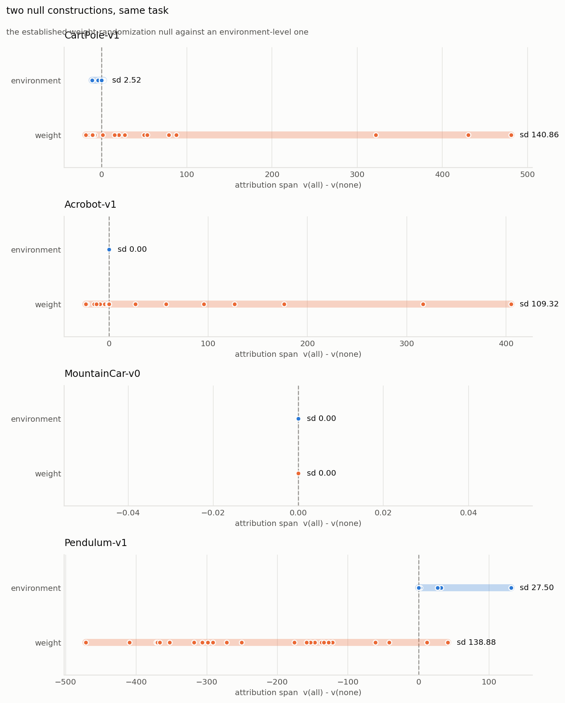

### 3.10 is the finding a property of Shapley, or of RL explanation?

integrated gradients shares no machinery with Shapley: it integrates the model's
gradient along a path from a baseline rather than averaging marginal
contributions over coalitions. both supply a scalar span for free, Shapley by
efficiency and IG by completeness, so the null test applies to either unchanged.

**per-feature attributions are not a Shapley artefact.** across all five seeds:

| feature | Shapley share | IG share |
|---|---|---|
| `time_to_expiry_frac` | 39.9% ± 3.6% | 33.3% ± 2.4% |
| `spread` | 18.7% ± 2.2% | 19.9% ± 1.7% |
| `time_in_position` | 10.5% ± 3.9% | 11.8% ± 5.4% |
| `implied_prob` | 7.4% ± 2.7% | 7.9% ± 2.7% |

the two families rank features at **+0.907** correlation with each other, and are
almost equally stable across seeds (**+0.808** Shapley, **+0.805** IG). so the
per-feature picture is a property of the agent rather than of the estimator.

**the null test, however, disagreed, and the reason is a flaw in this
experiment rather than a contradiction.**

| family | planted signal | real market |
|---|---|---|
| Shapley (§3.5) | z = +12.27 | **z = -0.15** |
| integrated gradients | z = +9.40 | **z = +3.93** |

both have power. but the comparison **confounds two variables**: the attribution
family and the attribution target. the Shapley span used throughout is an
*outcome-level* statistic, the difference in expected episode return between
observing everything and observing nothing. the IG span is a *behaviour-level*
statistic, how far the observation moves the policy from its baseline output.

read that way the two are consistent and the reading is informative: **the
agent's behaviour genuinely responds to its observations, and that
responsiveness earns nothing.** IG detects the responsiveness (z = +3.93);
the return-based span correctly reports that none of it reaches the outcome
(z = -0.15).

that is exactly the behaviour-versus-outcome distinction SVERL draws, arriving
here from an unplanned direction, and it strengthens rather than weakens the
case for outcome-based attribution: a behaviour-level statistic would have
told a practitioner this explanation was informative.

**what this does not establish.** whether the *outcome-level* result is
Shapley-specific remains open. IG cannot answer it, because episode return is
not differentiable with respect to the observation through the environment, so
there is no IG analogue of the return-based span. testing that needs a second
*perturbation-based* outcome method rather than a gradient one.

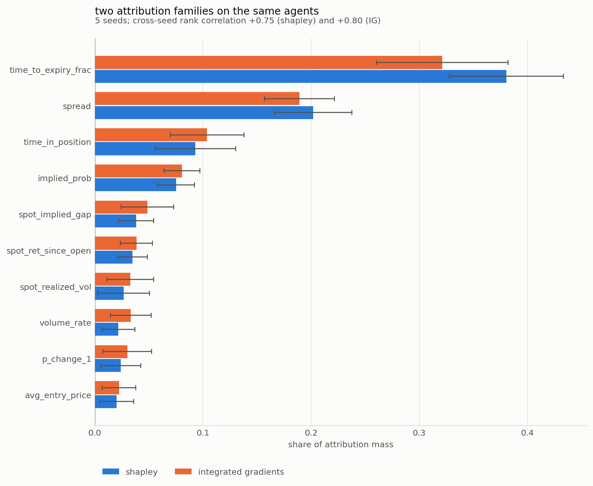
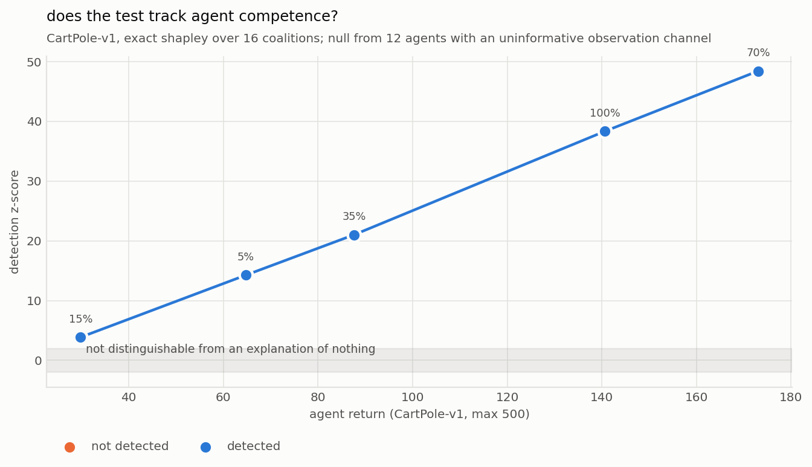

---

---

## 5. limitations

**the contribution is adaptation, not discovery.** section 3's attribution
argument is SVERL's; the test is Adebayo's, adapted.

**the span detects information in aggregate, not per feature.** an explanation
could clear the span test and still misattribute among features. the statistic
answers "is there anything here", not "is this the right decomposition".

**temporal credit assignment is named, not solved.** masking a feature for the
whole episode measures whether having it mattered, not *when*. that is what
FastSVERL addresses.

**off-policy attribution is not handled.** masked coalitions induce a different
policy and therefore a different state distribution, so estimates are on-policy
for the masked policy rather than counterfactuals about the unmasked one. read
the numbers comparatively rather than absolutely.

**the rank p-value has a resolution floor** at 1/(n+1), which cost an early run
its power at n = 8. both a rank and a normal p-value are reported and agreement
is required. a degenerate null (zero variance) is surfaced explicitly rather
than silently yielding z = 0.

**a reproducibility caveat about the data.** Kalshi's api serves a moving
window, so re-running the ingest on a different day returns a different set of
markets. a cold rebuild five days after the original produced 6,425 episodes
against 6,428, with 5,960 tickers in common, 468 present only in the original
and 465 only in the rebuild. **the overlapping episodes are byte-identical on
every field**, so the ingest is deterministic per market; what changes is
membership, not content. exact figures here are therefore reproducible in
method but not to the last decimal, and a re-run should be expected to land
close rather than identical.

**scope.** one market plus two classic-control tasks. one attribution family
(Shapley). the market agent's attributions use a single checkpoint for the
per-feature values, though the span test and stability analysis use all five
seeds.

## 6. references

1. Beechey, D., Smith, T. M. S., Şimşek, Ö. *Explaining Reinforcement Learning
   with Shapley Values.* ICML 2023. arXiv:2306.05810
2. Beechey, D., Şimşek, Ö. *Approximating Shapley Explanations in Reinforcement
   Learning.* NeurIPS 2025. arXiv:2511.06094
3. Adebayo, J. et al. *Sanity Checks for Saliency Maps.* NeurIPS 2018.
   arXiv:1810.03292
4. Huber, T. et al. *Benchmarking Perturbation-Based Saliency Maps for
   Explaining Atari Agents.* Frontiers in AI, 2022.
5. Lundberg, S., Lee, S.-I. *A Unified Approach to Interpreting Model
   Predictions.* NeurIPS 2017.
6. Shapley, L. S. *A Value for n-Person Games.* 1953.

## reproducing

```bash
./reproduce.sh              # everything, from public data, no api keys
./reproduce.sh --explain-only   # reuse checkpoints, regenerate the analyses
```

226 tests: `cd services/agent-rl && .venv/bin/python -m pytest`
