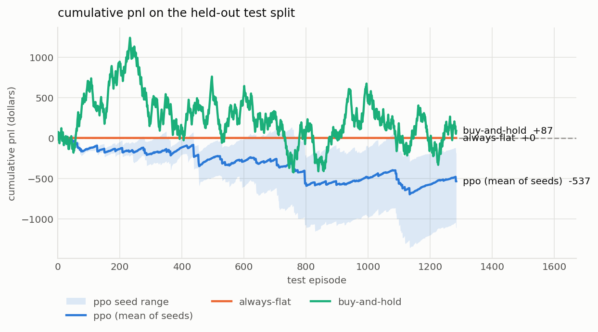
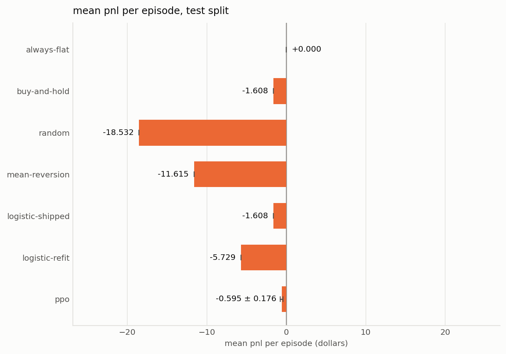
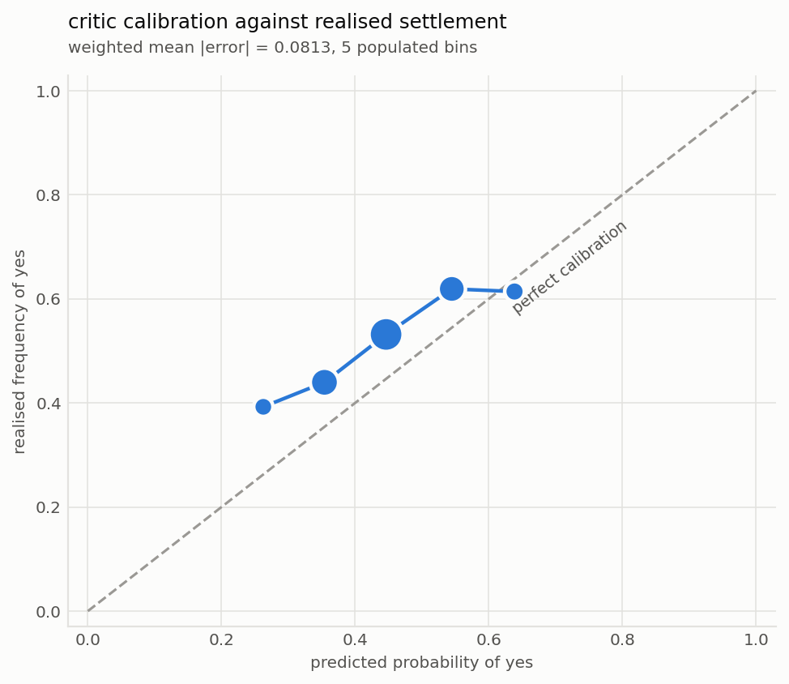

# a deep-RL trading agent on Kalshi binaries, evaluated honestly

a deep-RL agent on Kalshi 15-minute binary contracts, evaluated honestly, with a
Shapley explainability layer tested on problems where the correct answer is known
in advance.

**the result.** an agent with no measurable edge, on a provably efficient
market, produces feature attributions that are stable across seeds (rank
correlation 0.865, unanimous on the most important feature), structured, and
semantically plausible. a null-model test built from the Shapley efficiency
axiom shows those attributions are **indistinguishable from explanations of
agents with nothing to learn** (z = -0.15, p = 0.92), while correctly flagging a
planted signal as informative (z = +12.27). consistency across runs is therefore
not evidence that an explanation means anything (section 3.5), the ranking can
be certified stable under the standard estimation criterion while being
meaningless (3.7), and the whole explanation can be rewritten at no performance
cost, which cannot be done where a feature genuinely matters (3.8).

**what this contributes, and what it does not.** the argument that Shapley
explanations in RL should be built on outcomes rather than on the policy's output
is not mine. it is the thesis of SVERL (Beechey, Smith and Şimşek, ICML 2023),
which unifies behaviour, outcomes and prediction in one framework, and it is
extended by FastSVERL (Beechey and Şimşek, NeurIPS 2025) to the scalability,
off-policy and temporal problems this repository only names. what is here is an
independent from-scratch implementation of that argument, applied to a domain
they did not use, and validated on constructed problems where the right
attribution is known by construction. the code reproduces an existing idea and
tests it; it does not advance the theory.

---

## 1. the MDP

**instrument.** Kalshi `KXBTC15M`, "BTC price up in next 15 mins?", a binary
contract settling to $1.00 or $0.00. chosen over spot crypto for one property:
every episode resolves to a known outcome, so a critic's V(s) can be checked
against realised settlement frequency. that turns "explain the value predictions"
into a measurement rather than a narrative.

**state.** 18 strictly causal features: 9 from the Kalshi tape (implied
probability, spread, momentum, realised volatility, flow imbalance, volume,
staleness, time to expiry), 5 from Binance BTC spot joined backward as-of, and 4
position features (inventory, average entry, unrealised pnl, time in position).

**action.** discrete target position in {short, flat, long}. naming the level
rather than an increment makes position limits structural and makes "hold" a
genuine free action.

**reward.** change in mark-to-market equity net of costs. the rewards telescope
exactly, so `sum(r_t) = final equity`, making the dense signal return-equivalent
to the sparse terminal one at `gamma = 1` rather than a shaping heuristic.
terminal positions mark at true settlement, never at last traded price.

**data.** 6,428 settled markets over 68 days, 89,992 transitions, outcome rate
0.4995. walk-forward split by time (60/20/20) with purge gaps; test touched once.

**frictions.** Kalshi's taker fee is `ceil(0.07 · C · P · (1-P))`, maximised at
`P = 0.5`, which is where this contract trades by construction. with the measured
modal 1-cent spread that is a **9% round-trip hurdle** on a 50-cent notional.
this single fact determines most of what follows.

---

## 2. the market is efficient, and the agent does not beat it

the market's own implied probability is well calibrated: weighted mean absolute
calibration error **0.0172** across ten bins. the project's one alpha hypothesis,
that Kalshi's price lags Binance spot, is rejected on measurement: spot return
correlates **+0.4758** with the outcome but only **+0.0161** with the residual
after the price has had its say. detectable at 90k samples, worthless against a
9% hurdle.

### results on 1,285 held-out test episodes

| policy | mean pnl | trades/ep | p vs always-flat |
|---|---|---|---|
| always-flat | **+0.000** | 0.00 | reference |
| buy-and-hold | +0.068 | 1.00 | 0.96 |
| logistic (shipped) | +0.068 | 1.00 | 0.96 |
| **PPO, 5 seeds** | **-0.418 ± 0.260** | 1.37 | 0.13 |
| logistic (refit) | -9.102 | 2.58 | <0.0001 |
| mean-reversion | -10.928 | 5.12 | <0.0001 |
| random | -16.893 | 9.33 | <0.0001 |

**nothing beats doing nothing.** losses track turnover almost exactly. p-values
are paired bootstrap on the same episodes, which is necessary because per-episode
pnl has a standard deviation near 50 against differences near 1.

three things worth stating plainly.

**PPO's shortfall is its own, not the market's.** on synthetic data containing no
signal by construction, the same agent scores `-0.47 ± 0.47`. here it scores
`-0.418 ± 0.260`. those are the same number, so there is nothing left to
attribute to the market, and the bootstrap agrees at p = 0.13. what PPO did learn
is turnover discipline: 1.37 trades per episode against random's 9.33.

**the shipped LogisticRegression baseline is degenerate.** it scores identically
to buy-and-hold on every metric because it is a constant classifier: its largest
coefficient by two orders of magnitude sits on `window_len`, a constant
throughout its training data, making that coefficient a bias term. a refit on
this corpus is reported alongside it.

**costs are the binding constraint.** the zero-cost ablation moves PPO from
-0.418 to **+1.294**, so frictions cost 1.71 per episode. this separates "cannot
predict" from "predicts but cannot cover costs"; the answer is that neither
survives, but the failure is dominated by the second.

**the critic is calibrated but worse than the price it could have read**:
weighted mean absolute error **0.0813** against the market's 0.0172, with
predictions spanning only 0.26 to 0.64, shrinking toward the mean as a value
function trained on ±50 noise will.





---

## 3. explanations

the explainability work outgrew this document. it is written up separately in
**[docs/PAPER.md](PAPER.md)**, which covers the Shapley implementation and its
validation, the null-model test, the power curve, the steering result, and the
generalisation to CartPole and Acrobot.

the one finding that belongs here, because it changes how section 2 should be
read: the agent's explanations are **not distinguishable from explanations of
agents trained where there is nothing to learn** (z = -0.15, p = 0.92). an
earlier draft of this report stated that the whole observation was "worth +5.914
per episode against being blind" and presented it as a result. it was noise.

## 4. limitations

**the agent is weak, so its explanation is thin.** PPO does not reliably learn to
abstain on signal-free data: outcomes are bimodal across seeds (one abstains at
exactly 0.00, another commits at about -1), more training makes it worse (flat
fraction 0.62 at 80 updates, 0.03 at 250), and entropy tuning does not fix it.
explaining a near-inert policy is less informative than explaining a competent
one.

**the two grids agree on what matters.** the 60s corpus (6,428 episodes, 14
steps) and the 10s corpus (600 episodes, 89 steps) show the same median spread
of 0.0100 and outcome rates of 0.4995 and 0.4967. the finer grid adds real flow
imbalance, which the coarser one cannot carry. it does not change the picture.

**scope.** one instrument, 68 days, single venue. real-agent attributions use one
seed. spread is held constant within each 1-minute candle. maker fees are
unmodelled, so the taker assumption is conservative. the 10-second-grid corpus
was built but the robustness comparison against the 60-second grid was not run.

**what would follow.** attribution at timestep resolution rather than
whole-episode; off-policy corrections; and a stronger agent, since the most
interesting explanations require something worth explaining.

---

## reproducing

```bash
./reproduce.sh
```

fetches the corpus from public endpoints (no API key), trains 5 seeds, evaluates
on the held-out split, and regenerates every figure. fixed seeds, pinned
dependencies. 214 tests: `cd services/agent-rl && .venv/bin/python -m pytest`.

## references

1. Beechey, D., Smith, T. M. S., Şimşek, Ö. *Explaining Reinforcement Learning
   with Shapley Values.* ICML 2023. arXiv:2306.05810
2. Beechey, D., Şimşek, Ö. *Approximating Shapley Explanations in Reinforcement
   Learning.* NeurIPS 2025. arXiv:2511.06094
3. Adebayo, J. et al. *Sanity Checks for Saliency Maps.* NeurIPS 2018.
   arXiv:1810.03292
4. Lundberg, S., Lee, S.-I. *A Unified Approach to Interpreting Model
   Predictions.* NeurIPS 2017.
5. Schulman, J. et al. *Proximal Policy Optimization Algorithms.* 2017.
   arXiv:1707.06347
6. Schulman, J. et al. *High-Dimensional Continuous Control Using Generalized
   Advantage Estimation.* ICLR 2016. arXiv:1506.02438
7. Shapley, L. S. *A Value for n-Person Games.* 1953.
